# System Architecture

## 🏗️ High-Level Architecture

SalesOptimizer follows Domain-Driven Design (DDD) principles with clean separation of concerns across layers.

```mermaid
graph TB
    subgraph "FRONTEND (Next.js React TypeScript)"
        PWA[PWA Features<br/>• Service Worker<br/>• Push Notifications<br/>• Offline Cache<br/>• Background Sync]
        UI[UI Components<br/>• shadcn/ui<br/>• Tailwind CSS<br/>• Responsive Design<br/>• Accessibility]
        FEATURES[Feature Modules<br/>• Auth<br/>• Dashboard<br/>• Sales<br/>• Analytics<br/>• Tasks<br/>• Admin]
        STATE[State Management<br/>• Zustand<br/>• React Query<br/>• Local Storage<br/>• Session Storage]
    end
    
    subgraph "BACKEND (FastAPI Python)"
        API[API Layer<br/>• REST Endpoints<br/>• Authentication<br/>• Rate Limiting<br/>• CORS<br/>• OpenAPI/Swagger]
        APP[Application Layer<br/>• Use Cases<br/>• Command Handlers<br/>• Query Handlers<br/>• DTOs<br/>• Services]
        DOMAIN[Domain Layer<br/>• Entities<br/>• Aggregates<br/>• Value Objects<br/>• Domain Services<br/>• Repositories]
        INFRA[Infrastructure Layer<br/>• Database<br/>• External APIs<br/>• File Storage<br/>• Message Queue<br/>• ML Pipeline]
    end
    
    subgraph "DATA LAYER"
        DB[(PostgreSQL<br/>• Multi-tenant<br/>• ACID<br/>• Indexes<br/>• Constraints)]
        CACHE[(Redis<br/>• Sessions<br/>• Query Cache<br/>• Pub/Sub<br/>• Rate Limiting)]
        QUEUE[Celery<br/>• Background Tasks<br/>• ML Training<br/>• Email Sending<br/>• Data Processing]
        ML[ML Storage<br/>• Model Artifacts<br/>• Training Data<br/>• Feature Store<br/>• Predictions Cache]
    end
    
    subgraph "EXTERNAL SERVICES"
        EMAIL[Email Service<br/>• SMTP/SendGrid<br/>• Templates<br/>• Notifications]
        PUSH[Push Service<br/>• Web Push<br/>• FCM<br/>• APNs]
        STORAGE[File Storage<br/>• AWS S3<br/>• Local Storage<br/>• CDN]
    end
    
    %% Connections
    PWA --> API
    UI --> API
    FEATURES --> API
    STATE --> API
    
    API --> APP
    APP --> DOMAIN
    DOMAIN --> INFRA
    
    INFRA --> DB
    INFRA --> CACHE
    INFRA --> QUEUE
    INFRA --> ML
    
    QUEUE --> EMAIL
    QUEUE --> PUSH
    INFRA --> STORAGE
    
    %% Styling
    classDef frontend fill:#61dafb,color:#000
    classDef backend fill:#009688,color:#fff
    classDef data fill:#ff9800,color:#fff
    classDef external fill:#9c27b0,color:#fff
    
    class PWA,UI,FEATURES,STATE frontend
    class API,APP,DOMAIN,INFRA backend
    class DB,CACHE,QUEUE,ML data
    class EMAIL,PUSH,STORAGE external
```



## 🎯 Domain-Driven Design Structure

### Backend Domain Structure

```
app/
├── domain/                          # Domain Layer (Core Business Logic)
│   ├── organization/               # Multi-tenancy & User Management
│   │   ├── __init__.py
│   │   ├── entities/
│   │   │   ├── __init__.py
│   │   │   ├── tenant.py          # Tenant aggregate root
│   │   │   ├── user.py            # User entity
│   │   │   └── role.py            # Role and permissions
│   │   ├── value_objects/
│   │   │   ├── __init__.py
│   │   │   ├── tenant_id.py
│   │   │   ├── user_id.py
│   │   │   └── email.py
│   │   ├── repositories/
│   │   │   ├── __init__.py
│   │   │   ├── tenant_repository.py
│   │   │   └── user_repository.py
│   │   ├── services/
│   │   │   ├── __init__.py
│   │   │   ├── tenant_service.py
│   │   │   └── user_service.py
│   │   └── exceptions/
│   │       ├── __init__.py
│   │       └── organization_exceptions.py
│   │
│   ├── sales/                      # Sales Management
│   │   ├── __init__.py
│   │   ├── entities/
│   │   │   ├── __init__.py
│   │   │   ├── opportunity.py     # Opportunity aggregate root
│   │   │   ├── customer.py        # Customer entity
│   │   │   ├── interaction.py     # Customer interaction
│   │   │   └── pipeline.py        # Sales pipeline
│   │   ├── value_objects/
│   │   │   ├── __init__.py
│   │   │   ├── opportunity_id.py
│   │   │   ├── customer_id.py
│   │   │   ├── money.py           # Value object for currency
│   │   │   ├── stage.py           # Pipeline stage
│   │   │   └── contact_info.py
│   │   ├── repositories/
│   │   │   ├── __init__.py
│   │   │   ├── opportunity_repository.py
│   │   │   └── customer_repository.py
│   │   ├── services/
│   │   │   ├── __init__.py
│   │   │   ├── opportunity_service.py
│   │   │   └── pipeline_service.py
│   │   └── exceptions/
│   │       ├── __init__.py
│   │       └── sales_exceptions.py
│   │
│   ├── analytics/                  # Predictive Analytics
│   │   ├── __init__.py
│   │   ├── entities/
│   │   │   ├── __init__.py
│   │   │   ├── prediction_model.py
│   │   │   ├── historical_data.py
│   │   │   └── performance_metric.py
│   │   ├── value_objects/
│   │   │   ├── __init__.py
│   │   │   ├── success_probability.py
│   │   │   ├── confidence_score.py
│   │   │   └── time_period.py
│   │   ├── repositories/
│   │   │   ├── __init__.py
│   │   │   └── analytics_repository.py
│   │   ├── services/
│   │   │   ├── __init__.py
│   │   │   ├── prediction_service.py
│   │   │   └── analysis_service.py
│   │   └── exceptions/
│   │       ├── __init__.py
│   │       └── analytics_exceptions.py
│   │
│   ├── tasks/                      # Task Management
│   │   ├── __init__.py
│   │   ├── entities/
│   │   │   ├── __init__.py
│   │   │   ├── task.py            # Task aggregate root
│   │   │   ├── assignment.py      # Task assignment
│   │   │   └── collaboration.py   # Collaborative task
│   │   ├── value_objects/
│   │   │   ├── __init__.py
│   │   │   ├── task_id.py
│   │   │   ├── priority.py
│   │   │   ├── status.py
│   │   │   └── visibility.py      # Public/Private/Collaborative
│   │   ├── repositories/
│   │   │   ├── __init__.py
│   │   │   └── task_repository.py
│   │   ├── services/
│   │   │   ├── __init__.py
│   │   │   └── task_service.py
│   │   └── exceptions/
│   │       ├── __init__.py
│   │       └── task_exceptions.py
│   │
│   └── notifications/              # Notification System
│       ├── __init__.py
│       ├── entities/
│       │   ├── __init__.py
│       │   ├── notification.py    # Notification aggregate root
│       │   ├── subscription.py    # Push subscription
│       │   └── template.py        # Notification template
│       ├── value_objects/
│       │   ├── __init__.py
│       │   ├── notification_id.py
│       │   ├── message.py
│       │   └── delivery_status.py
│       ├── repositories/
│       │   ├── __init__.py
│       │   └── notification_repository.py
│       ├── services/
│       │   ├── __init__.py
│       │   ├── notification_service.py
│       │   └── push_service.py
│       └── exceptions/
│           ├── __init__.py
│           └── notification_exceptions.py
```

### Frontend Component Structure

```
src/
├── app/                           # Next.js App Router
│   ├── (auth)/                   # Route groups
│   │   ├── login/
│   │   └── register/
│   ├── (dashboard)/
│   │   ├── admin/
│   │   ├── manager/
│   │   └── sales/
│   ├── globals.css
│   ├── layout.tsx               # Root layout
│   └── page.tsx                 # Home page
│
├── components/                   # Reusable UI Components
│   ├── ui/                      # Base shadcn/ui components
│   │   ├── button.tsx
│   │   ├── card.tsx
│   │   ├── dialog.tsx
│   │   ├── form.tsx
│   │   ├── input.tsx
│   │   ├── table.tsx
│   │   └── ...
│   ├── layout/                  # Layout components
│   │   ├── header.tsx
│   │   ├── sidebar.tsx
│   │   ├── navigation.tsx
│   │   └── footer.tsx
│   ├── forms/                   # Form components
│   │   ├── login-form.tsx
│   │   ├── opportunity-form.tsx
│   │   ├── customer-form.tsx
│   │   └── task-form.tsx
│   ├── charts/                  # Chart components
│   │   ├── success-rate-chart.tsx
│   │   ├── pipeline-chart.tsx
│   │   ├── performance-chart.tsx
│   │   └── analytics-dashboard.tsx
│   └── common/                  # Common components
│       ├── loading-spinner.tsx
│       ├── error-boundary.tsx
│       ├── data-table.tsx
│       └── notification-toast.tsx
│
├── features/                    # Feature-based modules
│   ├── auth/                   # Authentication
│   │   ├── components/
│   │   │   ├── login-form.tsx
│   │   │   ├── register-form.tsx
│   │   │   └── role-selector.tsx
│   │   ├── hooks/
│   │   │   ├── useAuth.ts
│   │   │   └── useRoles.ts
│   │   ├── services/
│   │   │   └── auth-service.ts
│   │   ├── store/
│   │   │   └── auth-store.ts
│   │   └── types/
│   │       └── auth.types.ts
│   │
│   ├── dashboard/              # Dashboard features
│   │   ├── components/
│   │   │   ├── admin-dashboard.tsx
│   │   │   ├── manager-dashboard.tsx
│   │   │   ├── sales-dashboard.tsx
│   │   │   └── dashboard-metrics.tsx
│   │   ├── hooks/
│   │   │   └── useDashboard.ts
│   │   └── services/
│   │       └── dashboard-service.ts
│   │
│   ├── sales/                  # Sales management
│   │   ├── components/
│   │   │   ├── opportunity-list.tsx
│   │   │   ├── opportunity-details.tsx
│   │   │   ├── customer-profile.tsx
│   │   │   ├── pipeline-view.tsx
│   │   │   └── interaction-timeline.tsx
│   │   ├── hooks/
│   │   │   ├── useOpportunities.ts
│   │   │   └── useCustomers.ts
│   │   ├── services/
│   │   │   ├── opportunity-service.ts
│   │   │   └── customer-service.ts
│   │   ├── store/
│   │   │   └── sales-store.ts
│   │   └── types/
│   │       └── sales.types.ts
│   │
│   ├── analytics/              # Analytics features
│   │   ├── components/
│   │   │   ├── prediction-display.tsx
│   │   │   ├── success-metrics.tsx
│   │   │   ├── trend-analysis.tsx
│   │   │   └── report-generator.tsx
│   │   ├── hooks/
│   │   │   └── useAnalytics.ts
│   │   └── services/
│   │       └── analytics-service.ts
│   │
│   ├── tasks/                  # Task management
│   │   ├── components/
│   │   │   ├── task-list.tsx
│   │   │   ├── task-form.tsx
│   │   │   ├── task-assignment.tsx
│   │   │   └── collaboration-panel.tsx
│   │   ├── hooks/
│   │   │   └── useTasks.ts
│   │   └── services/
│   │       └── task-service.ts
│   │
│   └── admin/                  # Admin features
│       ├── components/
│       │   ├── user-management.tsx
│       │   ├── role-assignment.tsx
│       │   ├── audit-logs.tsx
│       │   └── system-settings.tsx
│       ├── hooks/
│       │   └── useAdmin.ts
│       └── services/
│           └── admin-service.ts
│
├── lib/                        # Utilities and configurations
│   ├── api.ts                 # API client configuration
│   ├── auth.ts                # Authentication utilities
│   ├── utils.ts               # General utilities
│   ├── validations.ts         # Form validation schemas
│   └── constants.ts           # Application constants
│
├── hooks/                      # Global custom hooks
│   ├── useLocalStorage.ts
│   ├── useNotifications.ts
│   ├── usePWA.ts
│   └── useWebSocket.ts
│
├── store/                      # Global state management
│   ├── index.ts               # Store configuration
│   ├── auth-slice.ts          # Authentication state
│   ├── notification-slice.ts   # Notification state
│   └── app-slice.ts           # General app state
│
└── types/                      # TypeScript type definitions
    ├── api.types.ts           # API response types
    ├── auth.types.ts          # Authentication types
    ├── sales.types.ts         # Sales domain types
    ├── analytics.types.ts     # Analytics types
    ├── task.types.ts          # Task types
    └── common.types.ts        # Common shared types
```

## 🗄️ Database Schema Design

### Multi-tenant Architecture

```sql
-- Core tenant isolation
CREATE TABLE tenants (
    id UUID PRIMARY KEY DEFAULT gen_random_uuid(),
    name VARCHAR(255) NOT NULL,
    slug VARCHAR(100) UNIQUE NOT NULL,
    settings JSONB DEFAULT '{}',
    subscription_tier VARCHAR(50) DEFAULT 'basic',
    is_active BOOLEAN DEFAULT TRUE,
    created_at TIMESTAMP WITH TIME ZONE DEFAULT NOW(),
    updated_at TIMESTAMP WITH TIME ZONE DEFAULT NOW()
);

-- Users with role-based access
CREATE TABLE users (
    id UUID PRIMARY KEY DEFAULT gen_random_uuid(),
    tenant_id UUID NOT NULL REFERENCES tenants(id) ON DELETE CASCADE,
    email VARCHAR(255) UNIQUE NOT NULL,
    password_hash VARCHAR(255) NOT NULL,
    first_name VARCHAR(100) NOT NULL,
    last_name VARCHAR(100) NOT NULL,
    role VARCHAR(50) NOT NULL CHECK (role IN ('super_admin', 'org_admin', 'manager', 'sales_rep')),
    is_active BOOLEAN DEFAULT TRUE,
    last_login TIMESTAMP WITH TIME ZONE,
    email_verified BOOLEAN DEFAULT FALSE,
    created_at TIMESTAMP WITH TIME ZONE DEFAULT NOW(),
    updated_at TIMESTAMP WITH TIME ZONE DEFAULT NOW()
);

-- Customers (tenant-isolated)
CREATE TABLE customers (
    id UUID PRIMARY KEY DEFAULT gen_random_uuid(),
    tenant_id UUID NOT NULL REFERENCES tenants(id) ON DELETE CASCADE,
    name VARCHAR(255) NOT NULL,
    email VARCHAR(255),
    phone VARCHAR(50),
    company VARCHAR(255),
    industry VARCHAR(100),
    address JSONB,
    notes TEXT,
    tags TEXT[],
    created_by UUID NOT NULL REFERENCES users(id),
    created_at TIMESTAMP WITH TIME ZONE DEFAULT NOW(),
    updated_at TIMESTAMP WITH TIME ZONE DEFAULT NOW()
);

-- Sales opportunities
CREATE TABLE opportunities (
    id UUID PRIMARY KEY DEFAULT gen_random_uuid(),
    tenant_id UUID NOT NULL REFERENCES tenants(id) ON DELETE CASCADE,
    customer_id UUID NOT NULL REFERENCES customers(id) ON DELETE CASCADE,
    assigned_to UUID NOT NULL REFERENCES users(id),
    title VARCHAR(255) NOT NULL,
    description TEXT,
    value DECIMAL(15,2) NOT NULL,
    currency VARCHAR(3) DEFAULT 'USD',
    stage VARCHAR(50) NOT NULL,
    probability INTEGER CHECK (probability >= 0 AND probability <= 100),
    expected_close_date DATE,
    actual_close_date DATE,
    source VARCHAR(100),
    priority VARCHAR(20) DEFAULT 'medium',
    is_won BOOLEAN,
    created_at TIMESTAMP WITH TIME ZONE DEFAULT NOW(),
    updated_at TIMESTAMP WITH TIME ZONE DEFAULT NOW()
);

-- Customer interactions
CREATE TABLE interactions (
    id UUID PRIMARY KEY DEFAULT gen_random_uuid(),
    tenant_id UUID NOT NULL REFERENCES tenants(id) ON DELETE CASCADE,
    customer_id UUID NOT NULL REFERENCES customers(id) ON DELETE CASCADE,
    opportunity_id UUID REFERENCES opportunities(id) ON DELETE SET NULL,
    user_id UUID NOT NULL REFERENCES users(id),
    type VARCHAR(50) NOT NULL,
    subject VARCHAR(255),
    content TEXT,
    outcome VARCHAR(255),
    follow_up_date DATE,
    duration_minutes INTEGER,
    interaction_date TIMESTAMP WITH TIME ZONE DEFAULT NOW(),
    created_at TIMESTAMP WITH TIME ZONE DEFAULT NOW()
);

-- Task management
CREATE TABLE tasks (
    id UUID PRIMARY KEY DEFAULT gen_random_uuid(),
    tenant_id UUID NOT NULL REFERENCES tenants(id) ON DELETE CASCADE,
    title VARCHAR(255) NOT NULL,
    description TEXT,
    assigned_to UUID NOT NULL REFERENCES users(id),
    assigned_by UUID NOT NULL REFERENCES users(id),
    opportunity_id UUID REFERENCES opportunities(id) ON DELETE SET NULL,
    customer_id UUID REFERENCES customers(id) ON DELETE SET NULL,
    status VARCHAR(50) DEFAULT 'pending',
    priority VARCHAR(20) DEFAULT 'medium',
    visibility VARCHAR(20) DEFAULT 'private' CHECK (visibility IN ('private', 'collaborative', 'public')),
    due_date TIMESTAMP WITH TIME ZONE,
    completed_at TIMESTAMP WITH TIME ZONE,
    tags TEXT[],
    attachments JSONB DEFAULT '[]',
    created_at TIMESTAMP WITH TIME ZONE DEFAULT NOW(),
    updated_at TIMESTAMP WITH TIME ZONE DEFAULT NOW()
);

-- Task collaborators (for collaborative tasks)
CREATE TABLE task_collaborators (
    id UUID PRIMARY KEY DEFAULT gen_random_uuid(),
    task_id UUID NOT NULL REFERENCES tasks(id) ON DELETE CASCADE,
    user_id UUID NOT NULL REFERENCES users(id) ON DELETE CASCADE,
    can_edit BOOLEAN DEFAULT FALSE,
    added_at TIMESTAMP WITH TIME ZONE DEFAULT NOW(),
    UNIQUE(task_id, user_id)
);

-- Notifications
CREATE TABLE notifications (
    id UUID PRIMARY KEY DEFAULT gen_random_uuid(),
    tenant_id UUID NOT NULL REFERENCES tenants(id) ON DELETE CASCADE,
    user_id UUID NOT NULL REFERENCES users(id) ON DELETE CASCADE,
    type VARCHAR(50) NOT NULL,
    title VARCHAR(255) NOT NULL,
    message TEXT NOT NULL,
    data JSONB DEFAULT '{}',
    is_read BOOLEAN DEFAULT FALSE,
    delivered_at TIMESTAMP WITH TIME ZONE,
    created_at TIMESTAMP WITH TIME ZONE DEFAULT NOW()
);

-- Push notification subscriptions
CREATE TABLE push_subscriptions (
    id UUID PRIMARY KEY DEFAULT gen_random_uuid(),
    user_id UUID NOT NULL REFERENCES users(id) ON DELETE CASCADE,
    endpoint TEXT NOT NULL,
    p256dh_key TEXT NOT NULL,
    auth_key TEXT NOT NULL,
    user_agent TEXT,
    is_active BOOLEAN DEFAULT TRUE,
    created_at TIMESTAMP WITH TIME ZONE DEFAULT NOW(),
    UNIQUE(user_id, endpoint)
);

-- ML predictions and analytics
CREATE TABLE predictions (
    id UUID PRIMARY KEY DEFAULT gen_random_uuid(),
    tenant_id UUID NOT NULL REFERENCES tenants(id) ON DELETE CASCADE,
    opportunity_id UUID NOT NULL REFERENCES opportunities(id) ON DELETE CASCADE,
    model_version VARCHAR(50) NOT NULL,
    success_probability DECIMAL(5,4)